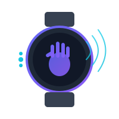

# WristControl

<p align="center">
  
</p>

<p align="center">
  <strong>Voice & Gesture Computer Control</strong><br>
  Control your computer with natural hand gestures and voice commands using your Samsung Galaxy Watch.
</p>

<p align="center">
  <a href="#features">Features</a> •
  <a href="#installation">Installation</a> •
  <a href="#usage">Usage</a> •
  <a href="#configuration">Configuration</a> •
  <a href="#contributing">Contributing</a>
</p>

---

## Overview

WristControl transforms your Samsung Galaxy Watch into a powerful input device, enabling hands-free computer control through natural gestures and voice commands. Move your cursor, click, scroll, and type without touching your keyboard or mouse.

**Key Differentiators:**
- **Voice Integration** - Full voice command and dictation support
- **Motion Cursor Control** - Continuous cursor movement from hand motion
- **Privacy Focused** - Local speech-to-text processing option
- **Open Source** - Fully customizable and extensible

## Features

### Gesture Control
- **Tap** - Left click (finger pinch)
- **Double Tap** - Double click
- **Hold** - Right click / context menu
- **Wrist Flick** - Scroll up/down
- **Palm Up** - Pause cursor control

### Voice Commands
- Mouse actions: click, double-click, right-click, scroll
- Keyboard shortcuts: copy, paste, undo, select all
- Text dictation: "type [your text]"
- Custom commands: define your own

### Cursor Control
- **Relative Mode** - Tilt hand to move cursor
- **Absolute Mode** - Point to position cursor
- Configurable sensitivity, acceleration, and dead zones

## Requirements

### Desktop
- Windows 10/11, macOS 11+, or Linux (BlueZ 5.50+)
- Bluetooth 4.0+ with BLE support
- Python 3.10+ (for source installation)

### Watch
- Samsung Galaxy Watch 4 or newer (Wear OS)
- Wear OS 3.0+ recommended

## Installation

### Pre-built Binaries

Download the latest release for your platform from the [Releases](https://github.com/wristcontrol/wristcontrol/releases) page.

### From PyPI

```bash
pip install wristcontrol
```

### From Source

```bash
# Clone the repository
git clone https://github.com/wristcontrol/wristcontrol.git
cd wristcontrol/desktop

# Create virtual environment
python -m venv venv
source venv/bin/activate  # Windows: venv\Scripts\activate

# Install in development mode
pip install -e ".[dev]"
```

## Usage

### Quick Start

1. **Install** the desktop app on your computer
2. **Enable Bluetooth** on both devices
3. **Install** the WristControl app on your Galaxy Watch
4. **Launch** both apps and follow the pairing wizard
5. **Start controlling** your computer with gestures and voice

### Running the Desktop App

```bash
# Run the application
wristcontrol

# Run with debug logging
wristcontrol --debug

# Run with specific config file
wristcontrol --config /path/to/config.json
```

### Basic Gestures

| Gesture | Action |
|---------|--------|
| Tap (pinch) | Left click |
| Double tap | Double click |
| Hold (500ms) | Right click |
| Wrist flick left/right | Scroll |
| Palm facing up | Pause control |

### Basic Voice Commands

```
"click"           → Left click
"double click"    → Double click
"right click"     → Context menu
"scroll up/down"  → Scroll
"copy" / "paste"  → Ctrl+C / Ctrl+V
"type hello"      → Types: hello
```

## Configuration

Configuration is stored in `~/.config/wristcontrol/config.json`:

```json
{
  "cursor": {
    "sensitivity": 1.0,
    "dead_zone": 0.1,
    "acceleration": 1.5,
    "smoothing": 0.3,
    "mode": "relative"
  },
  "gestures": {
    "tap_threshold": 0.5,
    "double_tap_window": 0.3,
    "hold_duration": 0.5,
    "enabled_gestures": ["tap", "double_tap", "hold", "wrist_flick"]
  },
  "voice": {
    "enabled": true,
    "backend": "whisper_local",
    "activation_mode": "push_to_talk"
  },
  "bluetooth": {
    "auto_reconnect": true
  }
}
```

See the [Configuration Guide](web/docs.html#settings) for detailed options.

## Project Structure

```
wristcontrol/
├── desktop/                 # Desktop companion app (Python)
│   ├── src/wristcontrol/   # Main package
│   │   ├── core/           # App logic & config
│   │   ├── bluetooth/      # BLE communication
│   │   ├── gestures/       # Gesture recognition
│   │   ├── voice/          # Speech-to-text
│   │   ├── cursor/         # Input injection
│   │   └── ui/             # User interface
│   └── tests/              # Unit tests
├── watch/                   # Watch app (Wear OS) [planned]
├── web/                     # Website & documentation
├── assets/                  # Logos & icons
└── planning/               # PRD & design docs
```

## Development

### Setup

```bash
cd desktop
pip install -e ".[dev]"
```

### Running Tests

```bash
pytest
pytest --cov=wristcontrol  # With coverage
```

### Code Quality

```bash
# Linting
ruff check src/

# Formatting
black src/

# Type checking
mypy src/
```

## Performance Targets

| Metric | Target |
|--------|--------|
| Input latency | < 50ms |
| Gesture accuracy | > 95% |
| Battery life | > 4 hours |
| Voice recognition | > 90% |

## Roadmap

- [x] Desktop app skeleton
- [x] Web assets & documentation
- [ ] Bluetooth LE connection
- [ ] Gesture recognition
- [ ] Voice command processing
- [ ] Motion cursor control
- [ ] Watch app (Wear OS)
- [ ] Configuration UI

## Contributing

Contributions are welcome! Please read our [Contributing Guide](CONTRIBUTING.md) for details.

1. Fork the repository
2. Create a feature branch (`git checkout -b feature/amazing-feature`)
3. Commit your changes (`git commit -m 'Add amazing feature'`)
4. Push to the branch (`git push origin feature/amazing-feature`)
5. Open a Pull Request

## License

This project is licensed under the MIT License - see the [LICENSE](LICENSE) file for details.

## Acknowledgments

- [DoublePoint TouchSDK](https://github.com/doublepointlab/touch-sdk-py) - Gesture detection reference
- [OpenAI Whisper](https://github.com/openai/whisper) - Local speech-to-text
- [Bleak](https://github.com/hbldh/bleak) - Cross-platform BLE library

---

<p align="center">
  Made with gestures and voice
</p>
